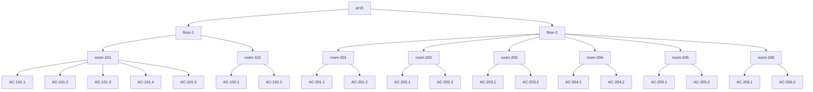

# Knowledge Graph Visualization

```mermaid
graph TD
    ar15 --> floor-1
    floor-1 --> room-101
    room-101 --> AC-101.1
    room-101 --> AC-101.2
    room-101 --> AC-101.3
    room-101 --> AC-101.4
    room-101 --> AC-101.5
    floor-1 --> room-102
    room-102 --> AC-102.1
    room-102 --> AC-102.2
    ar15 --> floor-2
    floor-2 --> room-201
    room-201 --> AC-201.1
    room-201 --> AC-201.2
    floor-2 --> room-202
    room-202 --> AC-202.1
    room-202 --> AC-202.2
    floor-2 --> room-203
    room-203 --> AC-203.1
    room-203 --> AC-203.2
    floor-2 --> room-204
    room-204 --> AC-204.1
    room-204 --> AC-204.2
    floor-2 --> room-205
    room-205 --> AC-205.1
    room-205 --> AC-205.2
    floor-2 --> room-206
    room-206 --> AC-206.1
    room-206 --> AC-206.2
```
