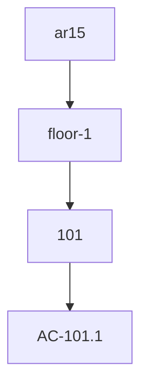

# แผนการศึกษา: การสร้าง Knowledge Graph จากไฟล์ Markdown Hierarchy (`ac.md`)

แผนการนี้จะช่วยพาคุณศึกษาการแปลงข้อมูลจากโครงสร้างต้นไม้ (Tree Diagram) ในไฟล์ Markdown ไปเป็นรูปแบบ Knowledge Graph ที่สามารถนำไปใช้งานต่อในระบบฐานข้อมูลหรือการทำ Visualization ได้

## 1. การวิเคราะห์โครงสร้างต้นไม้ใน Markdown
จากตัวอย่างไฟล์ `ac.md`:
```markdown
- ar15
    - floor-1
        - 101
            - AC-101.1
```
โครงสร้างนี้บอกความสัมพันธ์แบบ **Hierarchy (ลำดับชั้น)** ซึ่งในบริบทของ Knowledge Graph เราจะมองว่า:
- Node: `ar15`, `floor-1`, `101`, `AC-101.1`
- Edge: `contains` หรือ `part_of`

## 2. ขั้นตอนการแปลง (The Parsing Strategy)
เราจะสร้าง Script (เช่น Python หรือ JS) เพื่อประมวลผลตามอัลกอริทึมดังนี้:
1. **Read Line:** อ่านทีละบรรทัด
2. **Calculate Depth:** นับจำนวน Space/Tab ด้านหน้าเพื่อบอก Level (เช่น 0 spaces = level 0, 4 spaces = level 1)
3. **Track Parents:** ใช้ Stack เก็บ "Parent ประจำเลเวลที่แลว" เพื่อหาว่า Node ปัจจุบันเป็นลูกของใคร
4. **Generate Triplets:** สร้างชุดข้อมูลในรูปแบบ `(Subject, Predicate, Object)`

## 3. รูปแบบข้อมูลผลลัพธ์ (Knowledge Graph Representations)

### ก. Triplets (RDF Style)
ใช้สำหรับบรรจุลง Graph Database (เช่น Neo4j, GraphDB)
- `(ar15, contains, floor-1)`
- `(floor-1, contains, 101)`
- `(101, contains, AC-101.1)`

### ข. Visual Diagram (Mermaid.js)
สำหรับแสดงผลแบบสวยงามใน Markdown


## 4. สิ่งที่เราจะทำต่อในขั้นถัดไป
1. สร้างไฟล์ **Python Script `parse_kg.py`** เพื่อแปลง `ac.md` ให้กลายเป็นไฟล์ `nodes_edges.json`
2. สร้างไฟล์ **Mermaid Diagram** จากข้อมูลทั้งหมดใน `ac.md` เพื่อดูภาพรวมของทั้งตึก
3. (Optional) เชื่อมโยงข้อมูลนี้กับ Model 3D ที่คุณมีอยู่ในโปรเจกต์ (เช่น ค้นหา AC-101.1 ใน BuildingModel)

---
**คุณต้องการให้ผมเริ่มเขียน Script สำหรับการ Parse ข้อมูลเพื่อสร้าง Triplets เลยไหมครับ?**
